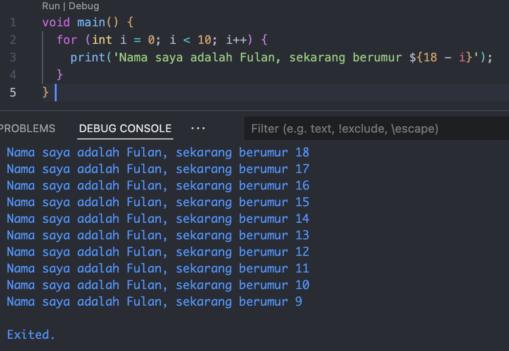

Rayyan Al Firdausi
2241720256

Soal 1!

Jawab: 
void main() {
  for (int i = 0; i < 10; i++) {
    print('Nama saya adalah Fulan, sekarang berumur ${18 - i}');
  }
} 

Soal 2!
Mengapa sangat penting untuk memahami bahasa pemrograman Dart sebelum kita menggunakan framework Flutter ? Jelaskan!
Jawab: 
Karena flutter sepenuhnya menggunakan bahasa dart.

Soal 3!
Rangkumlah materi dari codelab ini menjadi poin-poin penting yang dapat Anda gunakan untuk membantu proses pengembangan aplikasi mobile menggunakan framework Flutter.
Jawab: 
Dart adalah bahasa pemrograman yang dirancang untuk menggabungkan kelebihan bahasa tingkat tinggi dengan fitur modern seperti productive tooling (alat analisis kode dan plugin IDE), garbage collection (manajemen memori otomatis), dan type annotations opsional yang meningkatkan keamanan dan konsistensi data. Dart juga mendukung pengetikan statis dengan type-safe dan type inference untuk mendeteksi bug saat kompilasi, serta bersifat portable karena dapat dikompilasi menjadi JavaScript untuk web atau kode native ARM dan x86. Pemahaman yang kuat tentang Dart sangat penting dalam pengembangan Flutter, karena semua kode aplikasi, plugin, dan manajemen dependensi menggunakan Dart. Untuk memulai, Anda bisa menggunakan DartPad, alat online yang memudahkan eksperimen dan belajar fitur dasar Dart. Flutter sangat dipengaruhi oleh desain Dart, sehingga menguasai Dart akan membuat Anda lebih produktif dan nyaman dalam menggunakan Flutter.