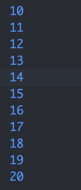

# Tugas Praktikum
### Nama : Rayyan Al Firdausi
### NIM : 2241720256
### Kelas : TI-3G (23)

## Praktikum 1:
```dart
// Langkah 1
void main() {
  String test = "test2";

  if (test == "test1") {
    print("Test1");
  } else if (test == "test2") {
    print("Test2");
  } else {
    print("Something else");
  }

  if (test == "test2") {
    print("Test2 again");
  }
  // Langkah 2: Variabel string akan mencari "test2" sampai ketemu, jika "test2" ketemu kode akan mengulang kode "Test2 again". 


  bool isTrue = true;
    if (isTrue) {
      print("Kebenaran");
  }

  // Langkah 3: Kode tersebut eror dikarenakan type data yang di inputkan adalah string dan valuenya adalah "true", dan String tersebut valuenya karakter. Maka saya mengubah dengan type data bool karena mempunyai value true atau false.
}
```
## Output:


## Praktikum 2:
``` dart 
// Langkah 1:
void main() {
  int counter = 0;

  while (counter < 33) {
    print(counter);
    counter++;
  }
  // Langkah 2: Terjadi eror dikarenakan tidak diinputkan type data yang bervalue sehingga kode tersebut tidak mengetahui sampai nilai berapa batas kode tersebut.

  do {
    print(counter);
    counter++;
  } while (counter < 77);
}
```
## Output:


## Praktikum 3:
``` dart
// Langkah 1
void main() {
  int index = 0;

  for (index = 10; index < 27; index++) {
    if (index == 21) break;
    else if (index > 1 && index < 7) continue;
    print(index);
  }
}

// Langkah 2 : Eror, dikarenakan ada 2 index yang menggunakan awalan katanya berbeda, dan itu harus menggunakan huruf kecil semua. Lalu menggunakan index++ pada for untuk menjalankan nilai index tersebut.

// Langkah 3: Eror, karena harus menggunakan huruf kecil untuk if dan else if. Dan mengubah kondisi dari || menjadi && agar semua kondisi harus benar dan hasilnya benar.
```
## Output:


## Tugas Praktikum:
``` dart
void main() {
  String nama = "Rayyan Al Firdausi";
  String nim = "2241720256";

  for (int number = 0; number <= 201; number++) {
    if (isPrime(number)) {
      print("Bilangan prima: $number");
      print("Nama lengkap: $nama");
      print("NIM: $nim");
    }
  }

}
  bool isPrime(int number) {
    if (number <= 1) return false;
    for (int i = 2; i <= number ~/ 2; i++) {
      if (number % i == 0) return false;
    }
    return true;
  }
```
## Output:
