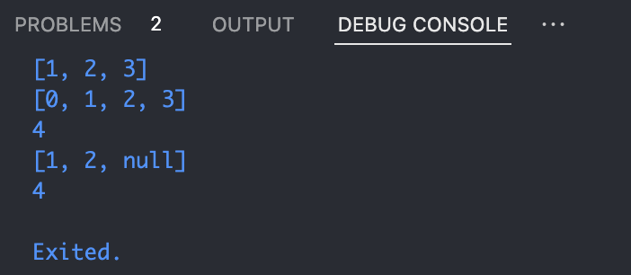

# Tugas Praktikum
### Nama : Rayyan Al Firdausi
### NIM : 2241720256
### Kelas : TI-3G (23)

## Praktikum 1:
### Langkah 1
```dart
void main() {
var list = [1, 2, 3];
assert(list.length == 3);
assert(list[1] == 2);
print(list.length);
print(list[1]);
  
list[1] = 1;
assert(list[1] == 1);
print(list[1]);
}
```
### Langkah 2:
Fungsi assert akan memastikan kondisi boolean pada ketentuan yang diminta bernilai true. Apabila ternyata bernilai false, maka kode akan terhenti dan menampilkan pesan error seperti ini.
### Ouput

### Langkah 3
```dart
void main() {
  final List<String?> list = [null, null, null, null, null];

  list[1] = "Rayyan Al Firdausi";
  list[2] = "2241720256";
  print(list);
}
```
### Ouput


## Praktikum 2
### Langkah 1
```dart
void main() {
var halogens = {'fluorine', 'chlorine', 'bromine', 'iodine','astatine'};
print(halogens);
}
```
### Langkah 2
Variabel var: membuat elemen halogens yang bervalue 'fluorine', 'chlorine', 'bromine', 'iodine', 'astatine', Sehingga ketika di "print" akan hanya memunculkan value tersebut
### Ouput

### Langkah 3
```dart
void main() {
  var halogens = {'fluroine', 'chlorine', 'bromine', 'iodine', 'astatine'};
  print(halogens);
  var names1 = <String>{};
  Set<String> names2 = {}; // This works, too.
  // var names3 = {}; // Creates a map, not a set.

  print(names1);
  print(names2);
  // print(names3);

  names1.add("Rayyan Al Firdausi");
  names1.add("2241720256");
  names2.addAll({"Rayyan Al Firdausi", "2241720256"});
  print(names1);
  print(names2);
}
//Jawab : Fungsi .add() akan menambahkan 1 value saja (Dalam konteks ini adalah string) sedangkan .addAll() akan menambahkan 1 atau lebih value berupa set (dalam konteks ini adalah set).
```
### Output


## Praktikum 3
### Langkah 1
```dart
void main() {
  var gifts = {
  // Key:    Value
  'first': 'partridge',
  'second': 'turtledoves',
  'fifth': 1
  };

  var nobleGases = {
    2: 'helium',
    10: 'neon',
    18: 2,
  };

  print(gifts);
  print(nobleGases);
}
```
### Langkah 2
### Ouput

Menampilkan nilai dari variabel gifts dan nobleGases berupa maps.

### Langkah 3
```dart
void main() {
  var gifts = {
  // Key:    Value
  'first': 'partridge',
  'second': 'turtledoves',
  'fifth': 1
  };

  var nobleGases = {
    2: 'helium',
    10: 'neon',
    18: 2,
  };

  var mhs1 = Map<String, String>();
  gifts['first'] = 'partridge';
  gifts['second'] = 'turtledoves';
  gifts['fifth'] = 'golden rings';

  var mhs2 = Map<int, String>();
  nobleGases[2] = 'helium';
  nobleGases[10] = 'neon';
  nobleGases[18] = 'argon';

  mhs1.addAll({
    'nama': 'Rayyan Al Firdausi',
    'nim': '2241720256',
  });
  mhs2.addAll({
    26: 'Rayyan Al Firdausi',
    34: '2241720256',
  });
  gifts.addAll({
    'nama': 'Rayyan Al Firdausi',
    'nim': '2241720256',
  });
  nobleGases.addAll({
    26: 'Rayyan Al Firdausi',
    34: '2241720256',
  });

  print(gifts);
  print(nobleGases);
  print(mhs1);
  print(mhs2);
}
/// Jawab : Menambahkan value ke dalam maps menggunakan fungsi .addAll().
```
### Ouput


## Praktikum 4
### Langkah 1
```dart
void main() {
  var list = [1, 2, 3];
  var list2 = [0, ...list];
  print(list1);
  print(list2);
  print(list2.length);
}
```
### Langkah 2
### Ouput

Jawab : Terjadi eror karena karena kode tidak menemukan variabel list1. Dapat dibuah menjadi print(list).
```dart
// Menjadi
void main() {
  var list = [1, 2, 3];
  var list2 = [0, ...list];
  print(list);
  print(list2);
  print(list2.length);
}
```
### Ouput

### Langkah 3
```dart
void main() {
  var list = [1, 2, 3];
  var list2 = [0, ...list];
  print(list);
  print(list2);
  print(list2.length);

  list1 = [1, 2, null];
  print(list1);
  var list3 = [0, ...?list1];
  print(list3.length);
}
// Jawab : Masih eror, dapat diatasi hanya dengan mendeklarasikan tipe data variabel list1
```
### Ouput

```dart
// Menjadi
void main() {
  var list = [1, 2, 3];
  var list2 = [0, ...list];
  print(list);
  print(list2);
  print(list2.length);

  var list1 = [1, 2, null];
  print(list1);
  var list3 = [0, ...?list1];
  print(list3.length);
}
```
### Ouput

### Langkah 4
```dart
void main() {
  var list = [1, 2, 3];
  var list2 = [0, ...list];
  print(list);
  print(list2);
  print(list2.length);

  var list1 = [1, 2, null];
  print(list1);
  var list3 = [0, ...?list1];
  print(list3.length);
  
  var nav = ['Home', 'Furniture', 'Plants', if (promoActive) 'Outlet'];
  print(nav);
}
```
### Ouput

```dart
Menjadi:
void main() {
  var list = [1, 2, 3];
  var list2 = [0, ...list];
  print(list);
  print(list2);
  print(list2.length);

  var list1 = [1, 2, null];
  print(list1);
  var list3 = [0, ...?list1];
  print(list3.length);
  
  bool promoActive = true;
  var nav = ['Home', 'Furniture', 'Plants', if (promoActive) 'Outlet'];
  print(nav);

  promoActive = false;
  nav = ['Home', 'Furniture', 'Plants', if (promoActive) 'Outlet'];
  print(nav);
}
```
### Ouput

### Langkah 5
```dart
void main() {
  var list = [1, 2, 3];
  var list2 = [0, ...list];
  print(list);
  print(list2);
  print(list2.length);

  var list1 = [1, 2, null];
  print(list1);
  var list3 = [0, ...?list1];
  print(list3.length);
  
  bool promoActive = true;
  var nav = ['Home', 'Furniture', 'Plants', if (promoActive) 'Outlet'];
  print(nav);

  promoActive = false;
  nav = ['Home', 'Furniture', 'Plants', if (promoActive) 'Outlet'];
  print(nav);

  var nav2 = ['Home', 'Furniture', 'Plants', if (login case 'Manager') 'Inventory'];
  print(nav2);
}
```
### Ouput

```dart
Menjadi:
void main() {
  var list = [1, 2, 3];
  var list2 = [0, ...list];
  print(list);
  print(list2);
  print(list2.length);

  var list1 = [1, 2, null];
  print(list1);
  var list3 = [0, ...?list1];
  print(list3.length);
  
  bool promoActive = true;
  var nav = ['Home', 'Furniture', 'Plants', if (promoActive) 'Outlet'];
  print(nav);

  promoActive = false;
  nav = ['Home', 'Furniture', 'Plants', if (promoActive) 'Outlet'];
  print(nav);

  String login = 'Manager';
  var nav2 = ['Home', 'Furniture', 'Plants', if (login case 'Manager') 'Inventory'];
  print(nav2);

  login = 'Employee';
  nav2 = ['Home', 'Furniture', 'Plants', if (login case 'Manager') 'Inventory'];
  print(nav2);
}
```
### Ouput

### Langkah 6
```dart
void main() {
  var list = [1, 2, 3];
  var list2 = [0, ...list];
  print(list);
  print(list2);
  print(list2.length);

  var list1 = [1, 2, null];
  print(list1);
  var list3 = [0, ...?list1];
  print(list3.length);
  
  bool promoActive = true;
  var nav = ['Home', 'Furniture', 'Plants', if (promoActive) 'Outlet'];
  print(nav);

  promoActive = false;
  nav = ['Home', 'Furniture', 'Plants', if (promoActive) 'Outlet'];
  print(nav);

  String login = 'Manager';
  var nav2 = ['Home', 'Furniture', 'Plants', if (login case 'Manager') 'Inventory'];
  print(nav2);

  login = 'Employee';
  nav2 = ['Home', 'Furniture', 'Plants', if (login case 'Manager') 'Inventory'];
  print(nav2);

  var listOfInts = [1, 2, 3];
  var listOfStrings = ['#0', for (var i in listOfInts) '#$i'];
  assert(listOfStrings[1] == '#1');
  print(listOfStrings);
}
// Jawab : Collection for dalam Dart adalah fitur yang memungkinkan kita menggunakan loop for di dalam koleksi seperti list, set, atau map. Ini membuat penulisan kode lebih ringkas dan lebih mudah dibaca ketika kita ingin menghasilkan collection berdasarkan logika tertentu.
```
### Ouput


## Praktikum 5
### Langkah 1
```dart
void main() {
  var record = ('first', a: 2, b: true, 'last');
  print(record);
}
```
### Langkah 2
### Ouput

### Langkah 3
```dart
void main() {
  var record = ('first', a: 2, b: true, 'last');
  print(record);

  (int, int) tukar((int, int) record) {
    var (a, b) = record;
    return (b, a);
  }

  var record2 = (1, 2);
  var record3 = tukar(record2);
  print(record3);
}
```
### Ouput

### Langkah 4
```dart
void main() {
  var record = ('first', a: 2, b: true, 'last');
  print(record);

  (int, int) tukar((int, int) record) {
    var (a, b) = record;
    return (b, a);
  }

  var record2 = (1, 2);
  var record3 = tukar(record2);
  print(record3);

  // Record type annotation in a variable declaration:
  (String, int) mahasiswa;
  print(mahasiswa);
}
```
### Ouput

```dart
Menjadi:
void main() {
  var record = ('first', a: 2, b: true, 'last');
  print(record);

  (int, int) tukar((int, int) record) {
    var (a, b) = record;
    return (b, a);
  }

  var record2 = (1, 2);
  var record3 = tukar(record2);
  print(record3);

  // Record type annotation in a variable declaration:
  (String, int) mahasiswa;
  mahasiswa = ('Rayyan Al Firdausi', 2241720256);
  print(mahasiswa);
}
```
### Ouput

### Langkah 5
```dart
void main() {
  var record = ('first', a: 2, b: true, 'last');
  print(record);

  (int, int) tukar((int, int) record) {
    var (a, b) = record;
    return (b, a);
  }

  var record2 = (1, 2);
  var record3 = tukar(record2);
  print(record3);

  // Record type annotation in a variable declaration:
  (String, int) mahasiswa;
  mahasiswa = ('Rayyan Al Firdausi', 2241720256);
  print(mahasiswa);

  var mahasiswa2 = ('first', a: 2, b: true, 'last');

  print(mahasiswa2.$1); // Prints 'first'
  print(mahasiswa2.a); // Prints 2
  print(mahasiswa2.b); // Prints true
  print(mahasiswa2.$2); // Prints 'last'
}
```
### Ouput


## Tugas Praktikum
1. Silakan selesaikan Praktikum 1 sampai 5, lalu dokumentasikan berupa screenshot hasil pekerjaan Anda beserta penjelasannya!
2. Jelaskan yang dimaksud Functions dalam bahasa Dart!
3. Jelaskan jenis-jenis parameter di Functions beserta contoh sintaksnya!
4. Jelaskan maksud Functions sebagai first-class objects beserta contoh sintaknya!
5. Apa itu Anonymous Functions? Jelaskan dan berikan contohnya!
6. Jelaskan perbedaan Lexical scope dan Lexical closures! Berikan contohnya!
7. Jelaskan dengan contoh cara membuat return multiple value di Functions!

### Jawab
1. Sudah
2. Functions di Dart adalah blok kode yang dapat dipanggil dan dieksekusi untuk menyelesaikan tugas tertentu. Mereka bisa menerima input (parameter) dan mengembalikan output (nilai). Dart mendukung berbagai fitur dalam function seperti parameter opsional, anonymous functions, dan closures.
3. Jenis-jenis Parameter :
- Positional Parameters: Parameter yang posisinya harus tepat ketika memanggil function.
```dart
 void greet(String name, int age) {
   print('Hello, $name! You are $age years old.');
 }
 void main() {
   greet("John", 25);
 }
```
- Optional Positional Parameters: Parameter opsional yang tidak harus diberikan saat function dipanggil.
```dart
void greet(String name, [int? age]) {
  print('Hello $name${age != null ? ", you are $age" : ""}');
}
void main() {
  greet('Alice');  // Output: Hello Alice
}
```
- Named Parameters: Parameter yang disebutkan dengan nama, membuat kode lebih eksplisit.
```dart
void greet({required String name, int? age}) {
  print('Hello $name${age != null ? ", you are $age" : ""}');
}
void main() {
  greet(name: 'Alice', age: 25);
}
```
- Default Parameters: Parameter dengan nilai default jika tidak disediakan.
```dart
void greet(String name, {int age = 18}) {
  print('Hello $name, you are $age years old');
}
void main() {
  greet('Alice');  // Output: Hello Alice, you are 18 years old
}
```
4. Functions di Dart adalah first-class objects, artinya dapat disimpan dalam variabel, diteruskan sebagai argumen, dan dikembalikan dari function lain. Hal ini memungkinkan fungsi diperlakukan seperti objek lain.
```dart
void printMessage(String message) {
   print(message);
}
void main() {
// Menyimpan fungsi dalam variabel
   var myFunction = printMessage;

// Memanggil fungsi melalui variabel
   myFunction("Hello, Dart!");

// Mengoper fungsi sebagai argumen
   executeFunction(myFunction);
}
void executeFunction(void Function(String) func) {
   func("Function executed.");
}
```
5. Anonymous function adalah fungsi yang tidak memiliki nama. Biasanya digunakan saat fungsi hanya dibutuhkan sekali, atau ketika fungsi ingin langsung digunakan sebagai argumen dalam fungsi lain.
```dart
void main() {
// Fungsi anonim dalam map
    var numbers = [1, 2, 3, 4];
    var squaredNumbers = numbers.map((number) => number * number).toList();
    print(squaredNumbers); // Output: [1, 4, 9, 16]

    // Fungsi anonim dalam event handler
    List<String> names = ['John', 'Jane', 'Doe'];
    names.forEach((name) {
        print(name);
    });
}
```
6. Lexical scope dan Lexical closures :
- Lexical Scope: Area di mana variabel-variabel yang didefinisikan dalam lingkup tersebut dapat diakses. Dart memiliki lexical scope, artinya variabel didefinisikan dalam ruang lingkup tertentu hanya dapat diakses di ruang lingkup tersebut atau yang lebih dalam.
```dart
void main() {
    int outerVar = 10;
    void innerFunction() {
        print(outerVar);  // outerVar dapat diakses di dalam scope ini
    }
    innerFunction();
}
```
- Lexical Closures: Closure adalah function yang "mengingat" lingkup di mana ia didefinisikan, bahkan ketika function itu dieksekusi di luar lingkup aslinya.
```dart
Function makeAdder(int addBy) {
    return (int i) => addBy + i;
}

void main() {
    var add2 = makeAdder(2);
    print(add2(3));  // Output: 5
}
```
7. Dart tidak secara langsung mendukung return multiple values, tetapi bisa menggunakan List, Map, atau Tuple untuk mengembalikan beberapa nilai sekaligus.
```dart
List<int> getMinMax(List<int> numbers) {
    int min = numbers.reduce((a, b) => a < b ? a : b);
   int max = numbers.reduce((a, b) => a > b ? a : b);
   return [min, max];
}

void main() {
   var numbers = [3, 5, 7, 2, 8];
   var result = getMinMax(numbers);
   print("Min: ${result[0]}, Max: ${result[1]}");
}
```